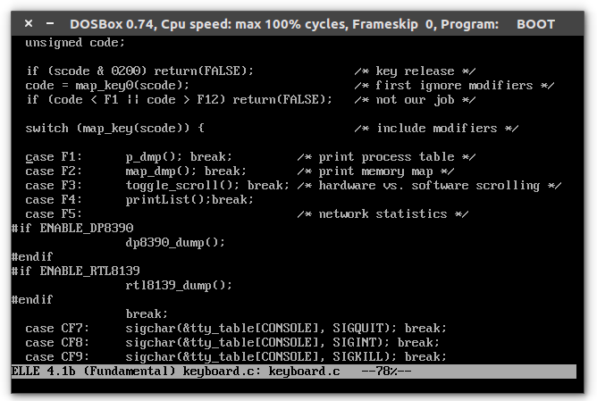

# Process Message Counter on Minix 2

## 1.DESCRIPTION

In computer science, message passing sends a message to a process (which may be an actor or object) and relies on the process and the supporting infrastructure to select and invoke the actual code to run. Message passing differs from conventional programming where a process, subroutine, or function is directly invoked by name.
Message passing is key to some models of concurrency and object-oriented programming.

Minix uses a message-passing paradigm to send and receive information among the processes for IPC purposes.

**Problem:** We want to count the messages between process i and j. After counting the messages, we want to print them on screen with user-friendly format when the F4 key is hit.

## 2.SOLUTION

Minix v2.0.4 under the usr/src/kernel changes were made.

First I have added a struct in glo.h to store the pieces of information properly. I've tried to store them in a linked list, but I had trouble in memory allocation operation
while adding items into the list.

Then I have created an array of structs which size of 60 in glo.h.

    
    glo.h Variables

I have added a global integer for track the processes globally.

In usr/src/kernel/proc.c I have created a function named addList(int src,int dst) to store the process informations and counters.Then I have modified mini\*send function.

    
    proc.c addList function

In mini_send function first I store caller_ptr pointers p_nr field as an integer named psource then I have called the addList function before the return statement with

psource and dest parameters which dest already exists in mini\*send function.

    
    proc.c addList call in mini_send  

Finally, I have modified usr/src/kernel/keyboard.c. I have added a function to print
the array and call it when the F4 key is hit.

keyboard.c printList function

keyboard.c printList on F4

After all these steps I have recompiled the OS in usr/src/tools with “make hdboot”

    
    Process Message Counter Table

## 3.REFERENCES

- https://en.wikipedia.org/wiki/Message_passing
